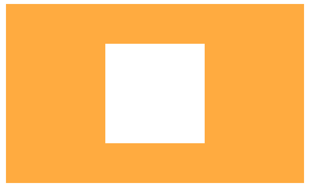
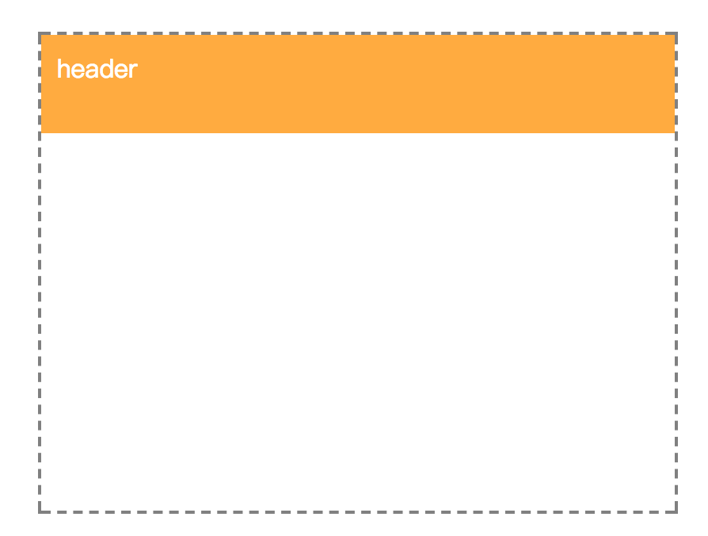

# 常用的编码规范

## HTML部分

### 语法

* 使用`2`个空格代替制表符；
* 默认缩进2个空格；
* 属性定义全部使用双引号`""`；
* 不在自闭和元素的尾部添加斜线`<br>`；
* 不省略可选的结束标签。

### 文档声明

为每个HTML页面添加标准HTML声明：

```html
<!DOCTYPE html>
```

### 语言属性

为 html 根元素指定 lang 属性，从而为文档设置正确的语言。这将有助于语音合成工具确定其所应该采用的发音，有助于翻译工具确定其翻译时所应遵守的规则等。

```html
<html lang="zh">
```

语言代码表：https://www.sitepoint.com/iso-2-letter-language-codes/

### IE 兼容模式

通知 IE 采用其所支持的最新的模式。

```html
<meta http-equiv="X-UA-Compatible" content="IE=Edge">
```

### 字符编码

直接声明字符编码，确保浏览器快速识别页面内容渲染方式。

```html
<meta charset="UTF-8">
```

### 引入 CSS 和 JavaScript 文件

在引入 CSS 和 JavaScript 文件时一般不需要指定 `type` 属性，因为 `text/css` 和 `text/javascript` 分别是它们的默认值。

```html
<!-- External CSS -->
<link rel="stylesheet" href="code-guide.css">

<!-- In-document CSS -->
<style>
  /* ... */
</style>

<!-- JavaScript -->
<script src="code-guide.js"></script>
```

### 属性顺序

HTML 属性应当按照以下给出的顺序依次排列，确保代码的易读性。

- `class`
- `id`, `name`
- `data-*`
- `src`, `for`, `type`, `href`, `value`
- `title`, `alt`
- `role`, `aria-*`

### 布尔（boolean）型属性

布尔型属性可以在声明时不赋值。XHTML 规范要求为其赋值，但是 HTML5 规范不需要。

### 减少标签的数量

编写 HTML 代码时，尽量避免多余的父元素。很多时候，这需要迭代和重构来实现。

```html
<!-- Not so great -->
<span class="avatar">
  
</span>

<!-- Better -->

```

### JavaScript 生成的标签

通过 JavaScript 生成的标签让内容变得不易查找、编辑，并且降低性能。能避免时尽量避免。

参考信息：http://codeguide.bootcss.com/#css-organization


## CSS部分

### 语法

* 使用`2`个空格代替制表符；
* 选择器分组时，每个选择器单独占一行；
* 每个声明块的左花括号`{`前添加一个空格；
* 每个声明块的右花括号`}`独占一行；
* 每条声明语句的分号`:``后插入一个空格；
* 每条声明独占一行；
* 所有声明语句都应当以分号结尾；
* 对于以逗号分隔的属性值，每个逗号后面都应该插入一个空格（例如，`box-shadow`）；
* 不要在 `rgb()`、`rgba()`、`hsl()`、`hsla()` 或 `rect()` 值的内部的逗号后面插入空格；
* 对于属性值或颜色参数，省略小于 1 的小数前面的 0 （例如，`.5` 代替 `0.5`；`-.5px` 代替 `-0.5px`）；
* 十六进制的值全部小写；
* 十六进制尽量使用简写；
* 属性选择器中的属性添加双引号`""`，`input[type="text"]；
* 属性值为0，去除单位。

### 声明顺序

相关的属性声明应当归为一组，并按照下面的顺序排列：

1. Positioning
2. Box model
3. Typographic
4. Visual

### 不要使用 `@import`

与 `<link>` 标签相比，`@import` 指令要慢很多，不光增加了额外的请求次数，还会导致不可预料的问题。替代办法有以下几种：

- 使用多个 `<link>` 元素
- 通过 Sass 或 Less 类似的 CSS 预处理器将多个 CSS 文件编译为一个文件
- 通过 Rails、Jekyll 或其他系统中提供过 CSS 文件合并功能

### 媒体查询（Media query）的位置

将媒体查询放在尽可能相关规则的附近。不要将他们打包放在一个单一样式文件中或者放在文档底部。

### 带前缀的属性

当使用特定厂商的带有前缀的属性时，通过缩进的方式，让每个属性的值在垂直方向对齐，这样便于多行编辑。

### 单行规则声明

对于**只包含一条声明**的样式，为了易读性和便于快速编辑，建议将语句放在同一行。对于带有多条声明的样式，还是应当将声明分为多行。

参考信息：http://codeguide.bootcss.com/#css-organization

### 命名技巧

#### 语义化

1. 语义化标签优先
2. 基于功能命名、基于内容命名、基于表现命名
3. 简略、明了、无后患

#### 命名规则

1. 所有命名都使用英文小写
2. 命名用引号包裹
3. 用中横线连接
4. 命名体现功能，不涉及表现样式(颜色、字体、边框、背景等)

# 垂直居中的几种实现方式

## padding垂直居中

```html
    <div class="content">
      <div class="box"></div>
    </div>
```

```css
    .content{
      width: 300px;
      padding: 40px 0;
      background-color: #FFAB40;
    }
    .box{
      width: 100px;
      height: 100px;
      margin: 0 auto;
      background-color: white;
    }
```

显示效果：



padding方法实现垂直居中的前提的父元素尽量不设置高度，设置上下padding值，子元素的高度随内容的变化而变化。

## 绝对定位垂直居中

```html
    <div class="content">
      <div class="header">header</div>
      <div class="side"></div>
    </div>
```

```css
    .content{
      position: absolute;
      left: 50%;
      top: 50%;
      width: 400px;
      height: 300px;

      /*子元素为固定尺寸
      margin-left: -200px;
      margin-top: -150px;*/

      /*子元素尺寸不固定*/
      transform: translate(-50%,-50%);

      border: 2px dashed gray;
    }
    .header,.side{
      padding: 10px;
      color: white;
      background-color: #FFAB40;
    }
```

显示效果：



## `vertical-align`垂直居中

```html
    <div class="content">
      <div class="side middle">
        
      </div>
    </div>
```

```css
  .content {
    width: 350px;
    margin: 40px auto;
  }

  .middle {
    text-align: center;
  }

  .middle:before {
    content: "";
    display: inline-block;
    height: 100%;
    vertical-align: middle;
  }

  .side {
    height: 500px;
    padding: 20px;
    box-shadow: 0 4px 8px 0 rgba(0, 0, 0, 0.2), 0 6px 20px 0 rgba(0, 0, 0, 0.19)!important;
  }

  .side img {
    width: 300px;
    vertical-align: middle;
  }
```

效果图：

作品预览：[链接地址](https://z2x.github.io/code-learning/web/vertical-align-middle.html)

### `table-cell`垂直居中

```html
    <div class="content">
      <div class="side">
        
      </div>
    </div>
```

```css
  .content {
    width: 350px;
    margin: 40px auto;
  }

  .side {
    height: 500px;
    padding: 20px;
    display: table-cell;
    vertical-align: middle;
    box-shadow: 0 4px 8px 0 rgba(0, 0, 0, 0.2), 0 6px 20px 0 rgba(0, 0, 0, 0.19)!important;
    text-align: center;
  }

  .side img {
    width: 300px;
  }
```

效果图和`vertical-align`垂直居中的显示一样。

小练习：

绘制气泡框：[查看链接](https://z2x.github.io/code-learning/web/bubble.html)


