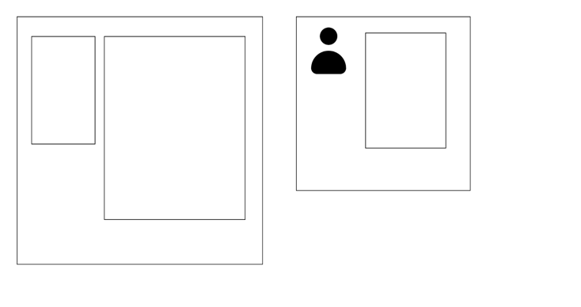
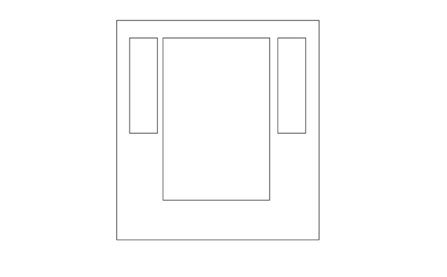

# 单列布局

## 模型


### 一栏布局

```html
    <div class="container">
      <div class="header"></div>
      <div class="content"></div>
      <div class="footer"></div>
    </div>
```

```css
      .container{
        max-width: 960px;
        margin: 0 auto;
      }
      .header{
        height: 60px;
        background-color: #00C853;
      }
      .content{
        height: 400px;
        background-color: #E0E0E0;
      }
      .footer{
        height: 50px;
        background-color: #03A9F4;
      }
```

查看链接：[点击查看](https://z2x.github.io/code-learning/web/layout-1.html)

**最大宽度属性max-width**

1.在CSS中，最大宽度属性(max-width)用来定义宽度显示的最大值，当拖动浏览器边框使其显示范围大于最大宽度的时候，元素显示最大宽度值定义的宽度。

2.在最大宽度属性值中，可以使用三种属性值，分别为auto值、长度值和百分比值，其语法结构如下所示:

```css
max-width: auto |  length  | percent;
```

注意：在IE6.0中，会忽略这个属性，将宽度使用默认值100%显示

### 一栏布局（通栏）

```html
  <div class="container">
    <div class="layout" id="header"></div>
    <div class="layout" id="content"></div>
    <div class="layout" id="footer"></div>
  </div>
```

```css
    .layout {
      min-width: 960px;
      margin: 0 auto;
    }

    #header {
      height: 60px;
      background-color: #00C853;
    }

    #content {
      height: 400px;
      background-color: #E0E0E0;
    }

    #footer {
      height: 50px;
      background-color: #03A9F4;
    }
```

查看链接：[点击查看](https://z2x.github.io/code-learning/web/layout-2.html)

**最小宽度属性min-width**

1.在CSS中，最小宽度属性(min-width)用来定义宽度显示的最小值，当拖动浏览器边框使其显示范围小于最小宽度的时候，元素显示最小宽度值定义的宽度。

2.在最小宽度属性中，可以使用三种属性值，分别为auto值、长度值和百分比值，其语法结构如下：

```css
min-width: aotu | length | percent;
```

注意：在IE6.0中，会忽略这个属性，将宽度使用默认值100%显示

# 双列布局

## 模型

一列固定宽度，另外一列自适应宽度



### 固定栏在左

```html
    <div class="container">
      <div class="side"></div>
      <div class="main"></div>
    </div>
    <div class="footer"></div>
```

```css
  .container {
    overflow: hidden;
  }

  .side {
    width: 200px;
    height: 500px;
    background-color: #00C853;
    float: left;
  }

  .main {
    margin-left: 210px;
    height: 400px;
    background: #03A9F4;
  }

  .footer {
    height: 50px;
    background-color: #FFCA28;
  }
```

查看链接：[点击查看](https://z2x.github.io/code-learning/web/layout-3.html)

### 固定栏在右

```html
  <div class="container">
    <div class="side"></div>
    <div class="main"></div>
  </div>
  <div class="footer"></div>
```

```css
  .container {
    overflow: hidden;
  }

  .side {
    width: 200px;
    height: 500px;
    background-color: #00C853;
    float: right;
  }

  .main {
    margin-right: 210px;
    height: 400px;
    background: #03A9F4;
  }

  .footer {
    height: 50px;
    background-color: #FFCA28;
  }
```

查看链接：[点击查看](https://z2x.github.io/code-learning/web/layout-4.html)

# 三列布局

## 模型

两侧两列固定宽度，中间列自适应宽度



### 浮动方法

```html
  <div class="container">
    <div class="side"></div>
    <div class="right"></div>
    <div class="main"></div>
  </div>
  <div class="footer"></div>
```

```css
  .container {
    overflow: hidden;
  }

  .side,right {
    width: 200px;
    height: 500px;
    background-color: #00C853;
    float: left;
  }

  .main {
    margin-right: 210px;
    margin-left: 210px;
    height: 400px;
    background: #03A9F4;
  }

  .right {
    float: right;
  }

  .footer {
    height: 50px;
    background-color: #FFCA28;
  }
```

查看链接：[点击查看](https://z2x.github.io/code-learning/web/layout-5.html)

### 绝对定位方法

```html
  <div class="container">
    <div class="side"></div>
    <div class="right"></div>
    <div class="main"></div>
  </div>
  <div class="footer"></div>
```

```css
  .container {
    width: 100%;
  }

  .side,
  .right {
    width: 200px;
    height: 500px;
    background-color: #00C853;
    position: absolute;
  }

  .main {
    margin-right: 210px;
    margin-left: 210px;
    height: 400px;
    background: #03A9F4;
  }

  .side {
    left: 0;
  }

  .right {
    right: 0;
  }

  .footer {
    height: 50px;
    background-color: #FFCA28;
    margin-top: 120px;
  }
```

查看链接：[点击查看](https://z2x.github.io/code-learning/web/layout-6.html)

## 双飞翼布局

```html
  <div class="wrap">
    <div class="main-content">
      <div class="main">main-content</div>
    </div>
    <div class="left">left</div>
    <div class="right">right</div>
  </div>
```

```css
  .wrap {
    width: 100%;
  }

  .wrap::after {
    display: block;
    content: '';
    font-size: 0;
    height: 0;
    clear: both;
    zoom: 1;
  }

  .main-content {
    float: left;
    width: 100%;
  }

  .main {
    height: 100px;
    background-color: green;
    margin-left: 110px;
    margin-right: 110px;
  }

  .left {
    float: left;
    width: 100px;
    height: 100px;
    background-color: orange;
    margin-left: -100%;
  }

  .right {
    float: left;
    width: 100px;
    height: 100px;
    background-color: orange;
    margin-left: -100px;
  }
```

查看链接：[点击查看](https://z2x.github.io/code-learning/web/layout-7.html)

### 圣杯布局

参考信息：[信息来源](https://alistapart.com/article/holygrail)

#### 要点：

1. 是3列布局，两边固定宽度，中间自适应；
2. 中间内容元素在dom元素次序种优先位置。

#### 缺点

自适应的最小宽度不能小于左边列的宽度。

```html
    <div id="content" class="clearfix">
        <div class="main">main</div>
        <div class="left">left</div>
        <div class="right">right</div>
    </div>
```

```css
    #clearfix:after{
        content: "";
        clear: both;
        display: block;
    }
    #content{
        padding: 0 110px 0 110px;
    }
    .main {
        width: 100%;
        height: 100px;
        background-color: green;
    }

    .left {
        width: 100px;
        height: 100px;
        background-color: orange;
        margin-left: -100%;
        position: relative;
        left: -110px;
    }

    .right {
        width: 100px;
        height: 100px;
        background-color: orange;
        margin-left: -100px;
        position: relative;
        right: -110px;
    }
    .main,.left,.right{
        float: left;
    }
```

查看链接：[点击查看](https://z2x.github.io/code-learning/web/layout-8.html)


练习作品1：[查看链接](https://z2x.github.io/code-learning/web/layout-practice-1.html)

练习作品1：[查看链接](https://z2x.github.io/code-learning/web/layout-practice-2.html)


