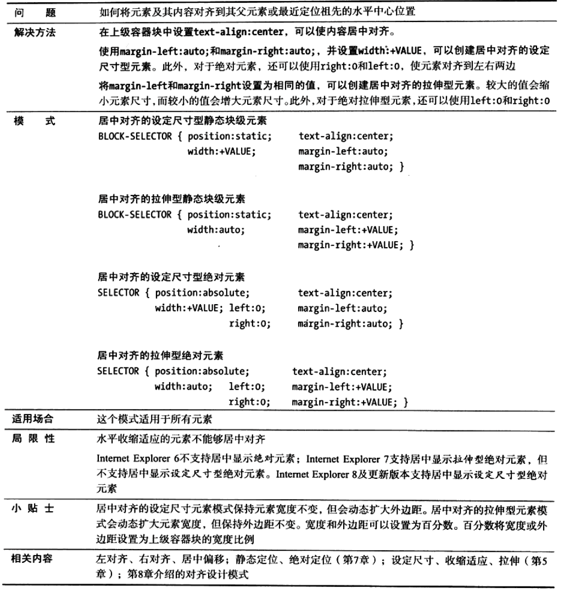

# text-align: center的作用是什么，作用在什么元素上？能让什么元素水平居中

text-align CSS属性定义行内内容（例如文字）如何相对于它的块父元素对齐，它并不控制块元素自己的对齐，只控制它的行内内容的对齐，其属性值有：

1. start:如果内容方向是左至右，则等于left，反之则为right。
2. end:如果内容方向是左至右，则等于right，反之则为left。
3. left:行内内容向左侧边对齐。
4. right:行内内容向右侧边对齐。
5. center:行内内容居中。
6. &lt;string&gt;:第一个出现的该（单字符）字符串被用来对齐。跟随的关键字定义对齐的方向。例如，可用于让数字值根据小数点对齐。
7. justify:文字向两侧对齐。
8. match-parent:和inherit类似，区别在于start和end的值根据父元素的direction确定，并被替换为恰当的left或right。

 text-align:center作用于行内元素，使行内元素居中。

 此外，在定位模式中，在上级容器块中设置`text-align:center;`，可以使内容水平居中对齐。
 

# IE 盒模型和W3C盒模型有什么区别?

W3C标准中padding、border所占的空间不在width、height范围内，大家俗称的IE的盒模型width包括content尺寸＋padding＋border

## IE盒模型


    width = border + padding + 内容的  width，
    height = border + padding + 内容的 height。

## W3C盒模型


尺寸计算公式：width = 内容的宽度，height = 内容的高度。宽度和高度都不包含内容的边框（border）和内边距（padding）。

## W3C盒模型在IE中的解决办法：

在代码顶部加如下的 doctype 声明，使页面以W3C盒子模型渲染。
```html
<!doctype html public "-//w3c//dtd xhtml 1.0 transitional//en" "http://www.w3.org/tr/xhtml1/dtd/xhtml1-transitional.dtd">
```

## 将W3C标准盒模型转化为IE盒模型

使用box-sizing属性

box-sizing 属性用于更改用于计算元素宽度和高度的默认的 CSS 盒子模型。可以使用此属性来模拟不正确支持CSS盒子模型规范的浏览器的行为。

其属性值有：

1. content-box：默认值，W3C标准盒子模型。
2. border-box：width 和 height 属性包括内容，内边距和边框，但不包括外边距。这是当文档处于 Quirks模式 时Internet Explorer使用的盒模型。
3. padding-box：width 和 height 属性包括内容和内边距，但是不包括边框和外边距。只有Firefox实现了这个值，它在Firefox 50中被删除。

参考信息：[信息来源](https://developer.mozilla.org/zh-CN/docs/Web/CSS/box-sizing)

# \*{ box-sizing: border-box;}的作用是什么？

将W3C标准盒模型转化为IE盒模型。

# line-height: 2和line-height: 200%有什么区别?

`line-height: 2`：行高是盒子模型里的content行高的两倍；

`line-height: 200%`：行高是父元素行高的两倍。

# inline-block有什么特性？如何去除缝隙？高度不一样的inline-block元素如何顶端对齐?

## 特性：
1. 既呈现 inline 特性(不占据一整行，宽度由内容宽度决定)
2. 又呈现 block 特性 (可设置宽高，内外边距)

## 缝隙问题的处理
* 内容之间不包含空格或者转行：

```html
<span>Hello</span><<span>World</span>
```

* 将父级元素的字体大小设置为0，子元素再设置字体大小：

```html
<head>
    <meta charset="utf-8">
    <meta http-equiv="X-UA-Compatible" content="IE=edge">
    <title></title>
    <link rel="stylesheet" href="">
    <style type="text/css" media="screen">
    body {
        text-align: center;
    }

    .content {
        font-size: 0;
    }

    .box {
        border: 1px solid black;
        display: inline-block;
        font-size: 16px;
        width: 100px;
    }
    </style>
</head>

<body>
    <div class="content">
        <span class="box">Hello</span>
        <span class="box">World</span>
    </div>
</body>
```


## 高度不一样的inline-block元素如何顶端对齐?

```
vertical-align:top;
```

# CSS sprite 是什么?

如果在一个页面上使用大量图片，每一张图片的加载一般都会给页面显示增加一定时间的延迟，同时也会给服务器增加负载，所以我们将多个图片组合到一个图片上，这个文件就称为CSS精灵图。

## 目的

减少http请求数，加速内容显示。
因为每请求一次，就会和服务器连接一次，建立连接是需要额外时间的。

## 使用场景：

1. 静态图片，不随用户信息的变化而变化
2. 小图片，图片容量比较小
3. 加载量比较大
4. 一些大图不建议拼成精灵图

## 实现原理

css的`background-position`属性来实现精灵图的显示。

控制一个层，可显示的区域范围大小；
通过一个窗口，进行背景图的滑动。

## 实现方式

1. photoshop手动拼图；
2. 使用sprite工具自动生成：
    * windows：[CSS Gaga](http://www.99css.com/tag/cssgaga/)
    * 通用在线工具：[访问地址](https://www.toptal.com/developers/css/sprite-generator)

## 缺点
1. 无法缩放
2. 不好修改

CSS sprite练习：[查看链接](http://zhued.gitee.io/blog/2018-02/code/css-sprite.html)

# Icon Font（把字体做成图标）

1. 制作字体文件

一般由设计师设计制作，并可上传至[http://www.iconfont.cn](http://www.iconfont.cn)进行使用。这里介绍网站上已有资源的使用。

打开网站[http://www.iconfont.cn](http://www.iconfont.cn)，搜索所需图标，选中后添加至购物车，点击购物车按钮并将选定的图标添加至项目（如果没有项目需进行新建），进入项目中便可进行相关信息查看，也可将文件进行下载使用。

2. 声明font-family
    * 使用本地链接
      将文件下载到本地进行引用。
    * 使用第三方链接
      在[http://www.iconfont.cn](http://www.iconfont.cn)项目中可以直接点击查看在线链接生成链接。
3. 使用font-family
    * 使用HTML实体
    * 使用CSS:before

```html
<head>
    <meta charset="utf-8">
    <meta http-equiv="X-UA-Compatible" content="IE=edge">
    <title>Icon Font</title>
    <link rel="stylesheet" href="">
    <style type="text/css" media="screen">
    @font-face {
        font-family: 'iconfont';
        /* project id 373290 */
        src: url('//at.alicdn.com/t/font_xu5ex3nf63onipb9.eot');
        src: url('//at.alicdn.com/t/font_xu5ex3nf63onipb9.eot?#iefix') format('embedded-opentype'),
        url('//at.alicdn.com/t/font_xu5ex3nf63onipb9.woff') format('woff'),
        url('//at.alicdn.com/t/font_xu5ex3nf63onipb9.ttf') format('truetype'),
        url('//at.alicdn.com/t/font_xu5ex3nf63onipb9.svg#iconfont') format('svg');
    }

    .iconfont {
        font-family: "iconfont" !important;
        font-size: 200px;
        font-style: normal;
        -webkit-font-smoothing: antialiased;
        -moz-osx-font-smoothing: grayscale;
    }

    .iconfont:hover {
        color: #D81E06;
    }

    .other-iconfont:before {
        content: "\e605";
    }
    </style>
</head>

<body>
    <!-- 使用HTML实体进行显示 -->
    <span class="iconfont">&#xe605;</span>

    <!-- 使用CSS:before进行显示 -->
    <span class="iconfont other-iconfont"></span>
</body>
```

Icon Font练习：[查看链接](http://zhued.gitee.io/blog/2018-02/code/icon-font.html)

# 让一个元素"看不见"有几种方式？有什么区别?

* `opacity: 0;` 透明度为0，但仍然在文档流中
* `visibility: hidden;` 使对象在网页上不可见，但该对象在网页上所占的空间没有改变
* `display:none;` 对象脱离文档流，不给它保留其物理空间，即该对象在页面上彻底消失
* `background-color: rgba(0，0，0，0.2);` 只是背景色透明
* `text-indent:-9999px；`将内容移动到看不见的地方
* `z-index`:设置为无限大的值如9999;或-9999让其覆盖或者被其他元素覆盖


模仿练习：[icecream](http://zhued.gitee.io/blog/2018-02/code/icecream.html)


