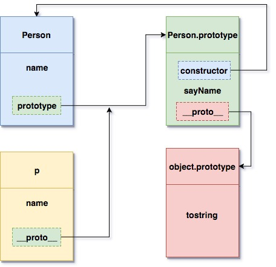

### this 相关问题

#### 问题1： apply、call 、bind有什么作用，什么区别

1. 使用call和apply都能够调用一个函数，并传入函数执行上下文及参数，其语法格式为：

```javascript
fn.call(context, param1, param2...)

fn.apply(context, paramArray)
```

其中第一个参数都表示希望设置的this对象。

* call和apply的区别

call()方法接受的是若干个参数的列表，而apply()方法接受的是一个包含多个参数的数组。

小例子：使用apply获取数组中的最大值

```javascript
function getMaxNumber(arr) {
  return Math.max.apply(null, arr);
}

var arr = [1, 2, 7, 4];
console.log(getMaxNumber(arr));
```

帮助记忆call和apply的小技巧：
```
猫吃鱼，狗吃肉，奥特曼打小怪兽。

有天狗想吃鱼了

猫.吃鱼.call(狗，鱼)

狗就吃到鱼了

猫成精了，想打怪兽

奥特曼.打小怪兽.call(猫，小怪兽)

//  来源于：https://zhihu.com/question/20289071/answer/258643285
```
2.

bind()方法创建一个新的函数, 当被调用时，将其this关键字设置为提供的值，在调用新函数时，在任何提供之前提供一个给定的参数序列。其语法格式为：

```javascript
fun.bind(thisArg[, arg1[, arg2[, ...]]])
```

小例子：当点击页面时打印出点击对象：

```javascript
document.addEventListener('click', function(e) {
  console.log(this);
  _this = this;
  setTimeout(function() {
    console.log(_this);
  }, 200);
}, false);
//  效果等同于以下内容
document.addEventListener('click', function(e) {
  console.log(this);
  setTimeout(function() {
    console.log(this);
  }.bind(this), 200);
}, false);

// # document
// # document
```

#### 问题2： 以下代码输出什么?
```javascript
var john = {
  firstName: "John"
};

function func() {
  alert(this.firstName + ": hi!");
}
john.sayHi = func;
john.sayHi();
//john:hi!
```

#### 问题3： 下面代码输出什么，为什么
```javascript
func();

function func() {
  alert(this);
}

// [object window],这里的this指向全局window
```

#### 问题4：下面代码输出什么
```javascript
document.addEventListener('click', function(e){
    console.log(this);
    setTimeout(function(){
        console.log(this);
    }, 200);
}, false);
// # document
// window
```

#### 问题5：下面代码输出什么，why
```javascript
var john = {
  firstName: "John"
};

function func() {
  alert(this.firstName);
}
func.call(john);
// john
// call方法将this指向john对象
```

#### 问题6： 以下代码有什么问题，如何修改
```javascript
var module = {
  bind: function() {
    $btn.on('click', function() {
      console.log(this); //this指什么
      this.showMsg();
    });
  },

  showMsg: function() {
    console.log('Hello World');
  }
};
```

this指的是事件触发对象$btn

代码修改后为：
```javascript
var module = {
  bind: function() {
    var _this = this;
    document.on('click', function() {
      console.log(this);
      _this.showMsg();
    });
  },

  showMsg: function() {
    console.log('Hello World');
  }
};
```

### 原型链相关问题

#### 问题7：有如下代码，解释Person、 prototype、__proto__、p、constructor之间的关联。
```javascript
function Person(name){
    this.name = name;
}
Person.prototype.sayName = function(){
    console.log('My name is :' + this.name);
}
var p = new Person("hello")
p.sayName();
```

```javascript
//  Person：通过函数定义的类
//  p是Person类的一个实例
//  prototype属性在函数定义的时候便会默认创建，但通过new来生成的对象没有这个属性

//  __proto__是实例p的一个内部属性，指向Person类的prototype属性
p.__proto__ === Person.prototype


p.__proto__ .constructor === Person.prototype.constructor === Person
Person.prototype.__proto__ === Object.prototype
Person.__proto__ === Function.prototype
```

#### 问题8： 上例中，对对象 p可以这样调用 p.toString()。toString是哪里来的? 画出原型图?并解释什么是原型链。



在JavaScript中，对象具有属性和方法，对象在调用方法时会首先在自身里寻找是否具有该方法，如果没有将向上一级对象的原型中进行查找，，一次层层迭进，一直到找到要调用的属性和方法，这就是原型链。

#### 问题9：对String做扩展，实现如下方式获取字符串中频率最高的字符
```javascript
var str = 'ahbbccdeddddfg';
var ch = str.getMostOften();
console.log(ch); //d , 因为d 出现了5次
```

```javascript
String.prototype.getMostOften = function() {
  var obj = {};
  var mostStr = {
    str: '',
    count: 0
  };

  for (var i = 0; i < this.length; i++) {
    if (obj[this[i]]) {
      obj[this[i]]++;
    } else {
      obj[this[i]] = 1;
    }

    if (obj[this[i]] > mostStr.count) {
      mostStr.str = this[i];
      mostStr.count = obj[this[i]];
    }
  }

  return mostStr;
};

var str = 'ahbbccdeddddfg';
var ch = str.getMostOften();
console.log(ch); // { str: 'd', count: 5 }
```

#### 问题10： instanceOf有什么作用？内部逻辑是如何实现的？

>>> instanceof 运算符用来测试一个对象在其原型链中是否存在一个构造函数的 prototype 属性。

语法格式为：
```javascript
object instanceof constructor
```
* object：要检测的对象；
* constructor：某个构造函数。

实现原理：

object通过__proto__属性层层向上寻找原型构造函数constructor，如果可以找到，返回true，否则返回false。

### 继承相关问题

#### 问题11：继承有什么作用?

使一个对象能够直接使用另一个对象的属性和方法。

#### 问题12： 下面两种写法有什么区别?
```javascript
//方法1
function People(name, sex){
    this.name = name;
    this.sex = sex;
    this.printName = function(){
        console.log(this.name);
    }
}
var p1 = new People('饥人谷', 2)

//方法2
function Person(name, sex){
    this.name = name;
    this.sex = sex;
}

Person.prototype.printName = function(){
    console.log(this.name);
}
var p1 = new Person('若愚', 27);
```

在方法1中printName方法直接定义在函数内部，每次创建新的实例都需要重新创建一次此方法，效率低，损耗性能。

在方法2中将printName绑定到prototype上，创建新的实例时直接调用即可，效率高。

#### 问题13： Object.create 有什么作用？兼容性如何？

>>> Object.create() 方法会使用指定的原型对象及其属性去创建一个新的对象。

Object.create() 是ES5方法,不兼容IE9以下版本。

#### 问题14： hasOwnProperty有什么作用？ 如何使用？

hasOwnPerperty是Object.prototype的一个方法，可以判断一个对象是否包含自定义属性而不是原型链上的属性，hasOwnProperty是JavaScript中唯一一个处理属性但是不查找原型链的函数

语法格式：
```javascript
obj.hasOwnProperty(prop)
```

* prop：要检测的属性字符串名称或者Symbol。

```javascript
m.hasOwnProperty('name'); // true
m.hasOwnProperty('printName'); // false
Male.prototype.hasOwnProperty('printAge'); // true
```

#### 问题15：如下代码中call的作用是什么?
```javascript
function Person(name, sex){
    this.name = name;
    this.sex = sex;
}
function Male(name, sex, age){
    Person.call(this, name, sex);    //这里的 call 有什么作用
    this.age = age;
}
```

让构造函数Person绑定到Male中，这样使Male就能够调用Person中的属性和方法。

#### 问题16： 补全代码，实现继承
```javascript
function Person(name, sex){
    // todo ...
}

Person.prototype.getName = function(){
    // todo ...
};

function Male(name, sex, age){
   //todo ...
}

//todo ...
Male.prototype.getAge = function(){
    //todo ...
};

var hello = new Male('hello', '男', 27);
hello.printName();
```

补全代码后为：
```javascript
function Person(name, sex) {
  this.name = name;
  this.sex = sex;
}

Person.prototype.printName = function() {
  console.log(this.name);
};

function Male(name, sex, age) {
  Person.call(this, name, sex);
  this.age = age;
}

Male.prototype = Object.create(Person.prototype);
Male.prototype.constructor = Male;
Male.prototype.getAge = function() {
  console.log(this.age);
};

var hello = new Male('hello', '男', 27);
hello.printName();
```
