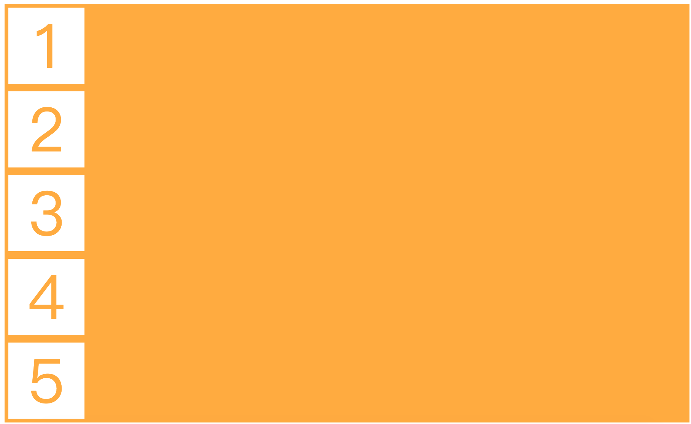
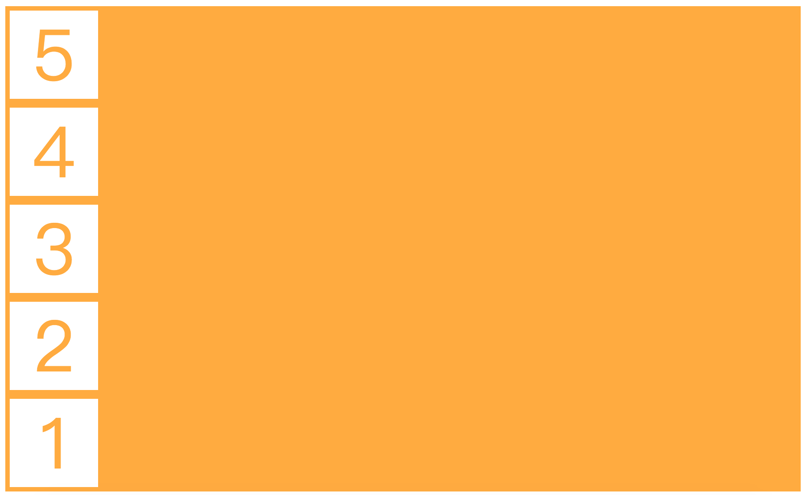
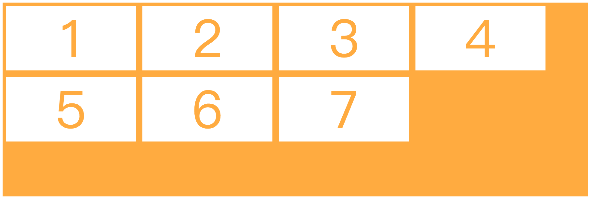
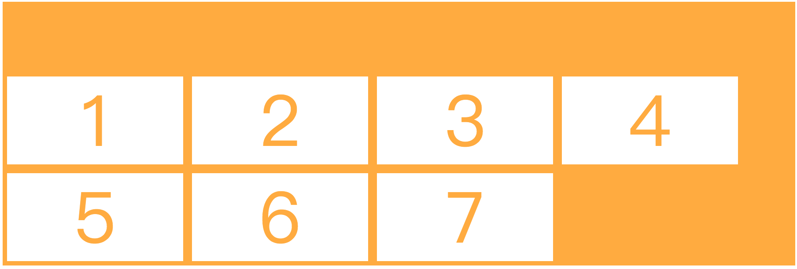
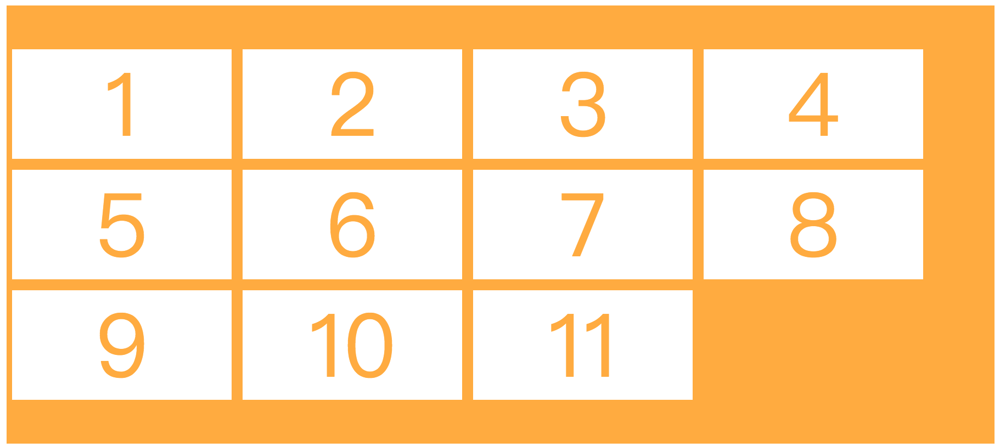
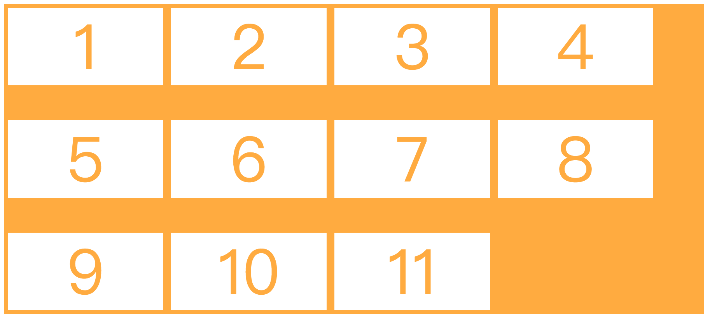
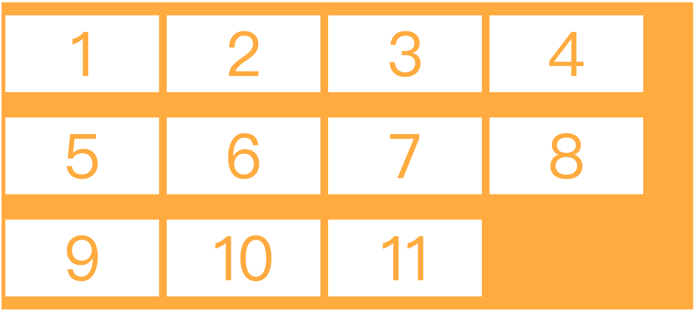
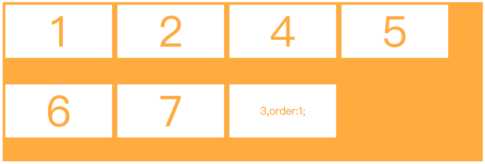
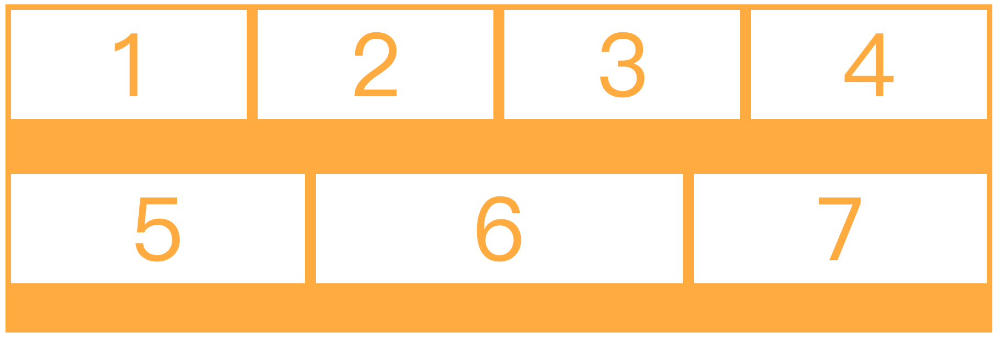

Flex box布局模型的主要目的是提供更有效率的布局方式，尤其是当容器内元素的尺寸不固定的时候更能表现出它的优势。它能够自动识别子元素的尺寸，从而为盒装模型提供更高的灵活性。

# 一、基本概念

如果元素采用Flex进行布局，那么这个元素就可以称为Flex容器（Flex container），元素的所有子元素称为Flex项目（Flex item）。


下图为Flexbox模型图：


## （一）几个术语

* main axis：水平主轴
* main-start：主轴开始位置，与边框的交叉点
* main-end：主轴的结束位置
* cross axis：垂直交叉轴
* cross-start：交叉轴的开始位置
* cross-end：交叉轴的结束位置
* main size：单个项目占据的主轴空间
* cross size：单个项目占据的交叉轴空间


# 二、浏览器兼容情况


点击查看更多信息：[flexbox-compatibility](http://caniuse.com/#feat=flexbox)

# 三、Flexbox容器的构造方法

1. 任何一个容器都可以指定为Flexbox布局：

```css
.flex-container {
  display: -webkit-flex; /* Safari */
  display: flex;
}
```

2. 行内元素可以指定Flexbox布局：

```css
.flex-container {
  display: -webkit-inline-flex; /* Safari */
  display: inline-flex;
}
```

**注意，设为 Flex 布局以后，子元素的`float`、`clear`和`vertical-align`属性将失效。**

# 四、Flexbox容器特性

## （一）flex-direction属性

`flex-direction`属性决定主轴的方向（即项目的排列方向）。

```css
.flex-container {
  flex-direction: row | row-reverse | column | column-reverse;
}
```


### Values:

```css
.flex-container {
  -webkit-flex-direction: row; /* Safari */
  flex-direction:         row; /* 默认值 */
}
```

主轴为水平方向，起点在左端:


```css
.flex-container {
  -webkit-flex-direction: row-reverse; /* Safari */
  flex-direction:         row-reverse;
}
```

主轴为水平方向，起点在右端:


```css
.flex-container {
  -webkit-flex-direction: column; /* Safari */
  flex-direction:         column;
}
```

主轴为垂直方向，起点在上端:



```css
.flex-container {
  -webkit-flex-direction: column-reverse; /* Safari */
  flex-direction:         column-reverse;
}
```

主轴为垂直方向，起点在下端:



##（二）flex-wrap属性
`flex-wrap`属性决定内容在抽线上排列不下的换行方式。

```css
.flex-container {
  flex-wrap: nowrap | wrap | wrap-reverse;
}
```
### Values:

```css
.flex-container {
  -webkit-flex-wrap: nowrap; /* Safari */
  flex-wrap:         nowrap; /* 默认 */
}
```


设置不换行。


```css
.flex-container {
  -webkit-flex-wrap: wrap; /* Safari */
  flex-wrap:         wrap;
}
```


设置自动换行，且第一行在上方。


```css
.flex-container {
  -webkit-flex-wrap: wrap-reverse; /* Safari */
  flex-wrap:         wrap-reverse;
}
```


设置自动换行，且第一行在下方。

## （三）flex-flow属性

`flex-flow`属性是`flex-direction`属性和`flex-wrap`属性的简写形式。

### **Values:**

```css
.flex-container {
  -webkit-flex-flow: <flex-direction> || <flex-wrap>; /* Safari */
  flex-flow:         <flex-direction> || <flex-wrap>;
}
```

默认属性值：

```css
.flex-container {
  -webkit-flex-flow: row nowrap; /* Safari */
  flex-flow:         row nowrap;
}
```

## （四）justify-content属性

`justify-content`属性定义项目在主轴上的对齐方式。

```css
.flex-container {
  justify-content: flex-start | flex-end | center | space-between | space-around;
}
```

### Values:

```css
.flex-container {
  -webkit-justify-content: flex-start; /* Safari */
  justify-content:         flex-start;
}
```

左对齐。

```css
.flex-container {
  -webkit-justify-content: flex-end; /* Safari */
  justify-content:         flex-end;
}
```

右对齐。

```css
.flex-container {
  -webkit-justify-content: center; /* Safari */
  justify-content:         center;
}
```

居中。

```css
.flex-container {
  -webkit-justify-content: space-between; /* Safari */
  justify-content:         space-between;
}
```

两端对齐，项目之间的间隔相等。

```css
.flex-container {
  -webkit-justify-content: space-around; /* Safari */
  justify-content:         space-around;
}
```

每个项目两侧的间隔相等。

## （五）align-items属性

`align-items`属性定义项目在交叉轴上的对齐方式。

```css
.flex-container {
  align-items: align-items: flex-start | flex-end | center | baseline | stretch;
}
```

### Values:

```css
.flex-container {
  -webkit-align-items: flex-start; /* Safari */
  align-items:         flex-start;
}
```

交叉轴的起点对齐。

```css
.flex-container {
  -webkit-align-items: flex-end; /* Safari */
  align-items:         flex-end;
}
```

交叉轴的终点对齐。

```css
.flex-container {
  -webkit-align-items: center; /* Safari */
  align-items:         center;
}
```

交叉轴的中点对齐。

```css
.flex-container {
  -webkit-align-items: baseline; /* Safari */
  align-items:         baseline;
}
```

项目的第一行文字的基线对齐。

```css
.flex-container {
  -webkit-align-items: stretch; /* Safari */
  align-items:         stretch;
}
```

如果项目未设置高度或设为auto，将占满整个容器的高度。

## （六）align-content属性

`align-content`定义了多根轴线的对齐方式。如果项目只有一根轴线，该属性不起作用。

```css
.flex-container {
  align-content: flex-start | flex-end | center | space-between | space-around | stretch;
}
```

### Values:

```css
.flex-container {
  -webkit-align-content: flex-start; /* Safari */
  align-content:         flex-start;
}
```

与交叉轴的起点对齐。

```css
.flex-container {
  -webkit-align-content: flex-end; /* Safari */
  align-content:         flex-end;
}
```

与交叉轴的终点对齐。

```css
.flex-container {
  -webkit-align-content: center; /* Safari */
  align-content:         center;
}
```

与交叉轴的中点对齐。

```css
.flex-container {
  -webkit-align-content: space-between; /* Safari */
  align-content:         space-between;
}
```

与交叉轴两端对齐，轴线之间的间隔平均分布。

```css
.flex-container {
  -webkit-align-content: space-around; /* Safari */
  align-content:         space-around;
}
```

每根轴线两侧的间隔都相等。

```css
.flex-container {
  -webkit-align-content: stretch; /* Safari */
  align-content:         stretch;
}
```

轴线占满整个交叉轴。

# 五、Flexbox项目特性
## （一）order属性
`order`属性定义项目的排列顺序。数值越小，排列越靠前，默认为`0`。
### Values:

```css
.flex-item {
  -webkit-order: <integer>; /* Safari */
  order:         <integer>;
}
```



## （二）flex-grow属性

`flex-grow`属性定义项目的放大比例，默认为`0`，即如果存在剩余空间，也不放大。

### Values:

```css
.flex-item {
  -webkit-flex-grow: <number>; /* Safari */
  flex-grow:         <number>;
}
```



如果所有项目的`flex-grow`属性都为`1`，则它们将等分剩余空间（如果有的话）。如果一个项目的`flex-grow`属性为`2`，其他项目都为`1`，则前者占据的剩余空间将比其他项多一倍。

## （三）flex-shrink属性

`flex-shrink`属性定义了项目的缩小比例，默认为`1`，即如果空间不足，该项目将缩小。

### Values:

```css
.flex-item {
  -webkit-flex-shrink: <number>; /* Safari */
  flex-shrink:         <number>;
}
```


如果所有项目的`flex-shrink`属性都为1，当空间不足时，都将等比例缩小。如果一个项目的`flex-shrink`属性为0，其他项目都为1，则空间不足时，前者不缩小。

负值对该属性无效。

## （四）flex-basis属性

`flex-basis`属性定义了在分配多余空间之前，项目占据的主轴空间（main size）。浏览器根据这个属性，计算主轴是否有多余空间。它的默认值为`auto`，即项目的本来大小。

### Values：

```css
.flex-item {
  -webkit-flex-basis: auto | <width>; /* Safari */
  flex-basis:         auto | <width>;
}
```

它可以设为跟`width`或`height`属性一样的值（比如350px），则项目将占据固定空间。

## （五）flex属性

`flex`属性是`flex-grow`, `flex-shrink` 和 `flex-basis`的简写，默认值为`0 1 auto`。后两个属性可选。

### Values：

```css
.flex-item {
  -webkit-flex: none | auto | [ <flex-grow> <flex-shrink>? || <flex-basis> ]; /* Safari */
  flex:         none | auto | [ <flex-grow> <flex-shrink>? || <flex-basis> ];
}
```

## （六）align-self属性

`align-self`属性允许单个项目有与其他项目不一样的对齐方式，可覆盖`align-items`属性。默认值为`auto`，表示继承父元素的`align-items`属性，如果没有父元素，则等同于`stretch`。

### Values：

```css
.flex-item {
  -webkit-align-self: auto | flex-start | flex-end | center | baseline | stretch; /* Safari */
  align-self:         auto | flex-start | flex-end | center | baseline | stretch;
}
```

参考信息：
[https://www.w3.org/html/ig/zh/css-flex-1/#intro](https://www.w3.org/html/ig/zh/css-flex-1/#intro)

[http://www.ruanyifeng.com/blog/2015/07/flex-grammar.html)](http://www.ruanyifeng.com/blog/2015/07/flex-grammar.html)

[https://scotch.io/tutorials/a-visual-guide-to-css3-flexbox-properties](https://scotch.io/tutorials/a-visual-guide-to-css3-flexbox-properties)

[https://css-tricks.com/snippets/css/a-guide-to-flexbox/](https://css-tricks.com/snippets/css/a-guide-to-flexbox/)

[https://developer.mozilla.org/zh-CN/docs/Learn/CSS/CSS_layout/Flexbox](https://developer.mozilla.org/zh-CN/docs/Learn/CSS/CSS_layout/Flexbox)


