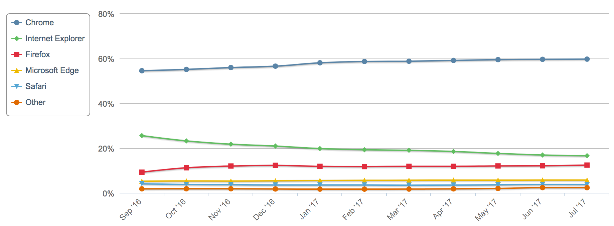
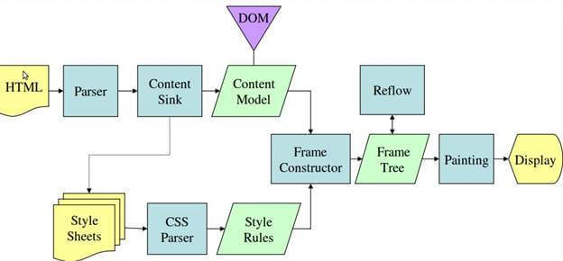
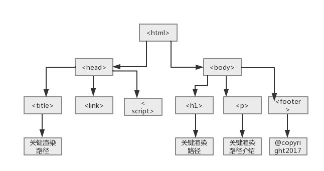
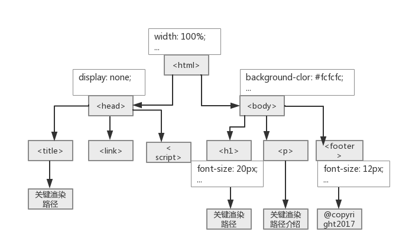

# 一、关于浏览器
网页浏览器，是一种能够用于检索并展示万维网信息资源的应用程序，这些资源不仅包括网页、图片、影音等媒体信息，还可以用来获取和传输专用网络中的信息文件。

主流网页浏览器有Mozilla Firefox、Internet Explorer、Microsoft Edge、Google Chrome、Opera及Safari。

##（一）最新浏览器市场份额情况



资料来源于：[netmarketshare](https://www.netmarketshare.com/)

## （二）浏览器内核

### 浏览器内核的2个组成部分

* 渲染引擎（layout engineer 或者 Rendering Engine）

1. 从服务器获取得到网页的内容（HTML、XML、图像等）；
2. 整理内容（加入CSS样式）；
3. 计算网页显示方式，并将内容输出至显示器或者打印机设备。

* JS引擎

主要负责解析JavaScript语言，执行JavaScript语言来实现网页的动态和交互效果。几种常见的JS引擎：

​	-- Rhino：由Mozilla基金会管理，开放源代码，完全以Java编写；

​	--SpiderMonkey：第一款JavaScript引擎，现在用于Firefox浏览器中；

​	--V8：由Google开发，开放源代码；

​	--JavaScriptCore：用于Safari浏览器，开放源代码；

​	--Chakra：用于IE浏览器；

​	--chakra：用于Microsoft Edge浏览器；

​	--KJS：KDE的ECMAScript／JavaScript引擎，最初由哈里·波顿开发，用于KDE项目的Konqueror网页浏览器中。

### 常见的浏览器内核

* Trident

微软Windows操作系统默认IE浏览器排版引擎，第一个版本随IE 4.0发布，一直沿用到IE 11。

* Gecko

Mozilla开放源代码项目的网页浏览器引擎，被各种来自基于Mozilla代码的派生产品所使用，包括Firefox网页浏览器、Thunderbird电子邮件客户端以及SeaMonkey网络包。

* Blink

2008年Google发布了chromium内核的chrome浏览器，而chromium内核fork于开源引擎Webkit。

2013年Google公司在chromium项目中独立研发Blink引擎，并将其内置于chrome浏览器中，但仍是Webkit引擎的一个分支。不久之后，Opera宣布放弃自己的浏览器引擎Presto，拥抱WebKit。

* Webkit

苹果公司基于KDE（一个Linux桌面系统）小组的HTML排版引擎开发。Safari浏览器使用的便是Webkit内核。

参考信息：[http://web.jobbole.com/84826/](http://web.jobbole.com/84826/)

### 浏览器的基础结构


1. **用户界面** - 包括地址栏、前进/后退按钮、书签菜单等。除了浏览器主窗口显示的您请求的页面外，其他显示的各个部分都属于用户界面。

2. **浏览器引擎** - 在用户界面和呈现引擎之间传送指令。

3. **呈现引擎** - 负责显示请求的内容。如果请求的内容是 HTML，它就负责解析 HTML 和 CSS 内容，并将解析后的内容显示在屏幕上。

4. **网络** - 用于网络调用，比如 HTTP 请求。其接口与平台无关，并为所有平台提供底层实现。

5. **用户界面后端** - 用于绘制基本的窗口小部件，比如组合框和窗口。其公开了与平台无关的通用接口，而在底层使用操作系统的用户界面方法。

6. **JavaScript 解释器**。用于解析和执行 JavaScript 代码。

7. **数据存储**。这是持久层。浏览器需要在硬盘上保存各种数据，例如 Cookie。新的 HTML 规范 (HTML5) 定义了“网络数据库”，这是一个完整（但是轻便）的浏览器内数据库。​

# 二、网络

用户访问web页面时，会发起网络请求，那么这个时候就会触发浏览器的网络模块：

1. IP地址请求：在浏览器地址栏中输入域名时，服务器需要根据域名去寻找对应的IP地址；

2. 浏览器获得并解析服务器的返回内容(HTTP response)；

3. 浏览器加载HTML文件及文件内包含的外部引用文件及图片，多媒体等资源。

   这个过程就好比去一个不知道地址的朋友家去取东西来用于展示，首先你要根据这个朋友的名字去寻找到她的住址，接下来去到他的家并得到东西内容，最后取回各种东西并用于展示出来。

## （一）DNS预解析

是一项使浏览器主动执行域名解析的功能，其范围包括文档的所有链接，无论是图片的，CSS 的，还是 JavaScript 等其他用户能够点击的 URL。

DNS预解析会在后台执行，能够减少用户点击链接时的延迟。

实现方式：用`meta`信息来告知浏览器当前页面的DNS预解析情况：

```html
<!--content的值可为on或者off-->
<meta http-equiv="x-dns-prefetch-control" content="on">
<meta http-equiv="x-dns-prefetch-control" content="off">
```

还可以在页面中使用link标签来强制对DNS预解析：

```html
<link rel="dns-prefetch" href="http://www.spreadfirefox.com/">
```

参考信息：[https://developer.mozilla.org/zh-CN/docs/Controlling_DNS_prefetching](https://developer.mozilla.org/zh-CN/docs/Controlling_DNS_prefetching)


## （二）多线程

我们通常说JavaScript执行是单线程的，但是浏览器网络部分通常是有几个平行线程同时开启，但是也会有限制，一般为2-6个。

**在浏览器的开发者工具网络模块中可以查看详细网络信息**


# 三、渲染引擎及关键渲染路径

通过网络模块获取到文件资源后，渲染引擎将开始对文件资源进行渲染，将用户请求内容展示出来。

通过网络模块加载文件，然后进行渲染的流程被称为关键渲染路径：

1. 构建DOM树(DOM tree)：从上到下解析HTML文档生成DOM节点树（DOM tree），也叫内容树（content tree）；

2. 构建CSSOM(CSS Object Model)树：加载解析样式生成CSSOM树；

3. 执行JavaScript：加载并执行JavaScript代码（包括内联代码或外联JavaScript文件）；

4. 构建渲染树(render tree)：根据DOM树和CSSOM树,生成渲染树(render tree)；

   渲染树：按顺序展示在屏幕上的一系列矩形，这些矩形带有字体，颜色和尺寸等视觉属性。

5. 布局（layout）：根据渲染树将节点树的每一个节点布局在屏幕上的正确位置；

6. 绘制（painting）：遍历渲染树绘制所有节点，为每一个节点适用对应的样式，这一过程是通过UI后端模块完成；


需要注意的是，为了更友好的用户体验，浏览器进行渲染时，采用由上到下的渲染方式，而不是一次性全部渲染完成。


## （一）浏览器渲染主流程图

Webkit渲染引擎流程如下图：


Gecko渲染引擎流程如下图：



Gecko 将视觉格式化元素组成的树称为“框架树”。每个元素都是一个框架。WebKit 使用的术语是“呈现树”，它由“呈现对象”组成。对于元素的放置，WebKit 使用的术语是“布局”，而 Gecko 称之为“重排”。对于连接 DOM 节点和可视化信息从而创建呈现树的过程，WebKit 使用的术语是“附加”。有一个细微的非语义差别，就是 Gecko 在 HTML 与 DOM 树之间还有一个称为“内容槽”的层，用于生成 DOM 元素。


## （二）单线程

渲染流程为单线程，不同于网络部分的多线程。

## （三）处理脚本和样式表的顺序

* 脚本的处理

通常情况下，JavaScript脚本会改变文档的DOM结构，所以浏览器将内容和JavaScript脚本同时解析，当解析器遇到`<script>`标签时立即解析并执行脚本，此时文档内容的解析将停止，直到脚本内容完成执行。如果脚本是引入的外部文件，文档解析还将等待外部脚本加载完成并执行后再继续。

正因为Javascript脚本会阻塞文档解析，所以通常将`<script>`标签放在`</body>`标签前面。

但现在HTML5提供相关属性来支持延迟和异步加载JavaScript文件，这2个属性是：

`defer`属性：有顺序，加载后续文档元素的过程将和 script.js 的加载并行进行（异步），但 script.js 的执行要在所有元素解析完成之后，DOMContentLoaded 事件触发之前完成。

`async`属性：不保证顺序，加载和渲染后续文档元素的过程将和 script.js 的加载与执行并行进行（异步）。

使用示例：

```html
<script src="script.js"></script>

<script defer src="script.js"></script>

<script async src="script.js"></script>
```


* 样式表的处理

样式表加载模型和脚本加载模型不同，正常情况下，样式表不会更改DOM树，因此不会阻塞脚本文件的加载执行。但脚本在文档解析阶段是也会请求样式信息，如果此时还没有加载和解析样式，脚本就会获得错误信息，此时Firefox 在样式表加载和解析的过程中，会禁止所有脚本。而对于 WebKit 而言，仅当脚本尝试访问的样式属性可能受尚未加载的样式表影响时，它才会禁止该脚本。

在样式表的处理过程中，一般会遇到白屏问题和无样式内容闪烁。

**白屏问题**：如果把样式放在底部,对于IE浏览器,在某些场景下(新窗口打开,刷新等)页面会出现白屏,而不是内容逐步展现；

如果使用 `@import` 标签,即使 CSS 放入 link, 并且放在头部,也可能出现白屏。

**FOUC (Flash of Unstyled Content) 无样式内容闪烁**：如果把样式放在底部,对于IE浏览器,在某些场景下(点击链接,输入URL,使用书签进入等),会出现 FOUC 现象(逐步加载无样式的内容,等CSS加载后页面突然展现样式).对于 Firefox 会一直表现出 FOUC 。

## （四）构建DOM树

将文档内的所有节点构建成为DOM树形结构。

```html
<html>
<head>
  <title>Understanding the Critical Rendering Path</title>
  <link rel="stylesheet" href="style.css">
</head>
<body>
  <header>
      <h1>Understanding the Critical Rendering Path</h1>
  </header>
  <main>
      <h2>Introduction</h2>
      <p>Lorem ipsum dolor sit amet</p>
  </main>
  <footer>
      <small>Copyright 2017</small>
  </footer>
</body>
</html>
```

​	以上内容将构建以下DOM树：




## （五）构建CSSOM树

与DOM树类似，在构建的同时为每一个节点关联样式信息。

在上一部分DOM树中添加以下样式：

```css
body { font-size: 18px; }

header { color: plum; }
h1 { font-size: 28px; }

main { color: firebrick; }
h2 { font-size: 20px; }

footer { display: none; }
```

以上内容将构建以下CSSOM树：




## （六）执行JavaScript脚本

加载并执行JavaScript代码。

```Html
<script async src="script.js">
```


## （七）构建渲染树


## (八)布局

这个阶段利用渲染树中的渲染信息，计算渲染对象的坐标和大小，通过换行，position，overflow，z-index等为其找到正确的位置。

## (九)绘制

浏览器遍历渲染树并且调用渲染对象的绘制方法，结合浏览器自身UI组件将内容展示给用户。


参考信息：

[前端优化:DNS预解析提升页面速度](http://skyhome.cn/div_css/301.html)

[浅析前端页面渲染机制](http://blog.codingplayboy.com/2017/03/29/webpage_render/#i-6)

[Understanding the Critical Rendering Path](https://bitsofco.de/understanding-the-critical-rendering-path/)

[浏览器渲染原理](http://imweb.io/topic/56841c864c44bcc56092e3fa)

[浏览器的工作原理：新式网络浏览器幕后揭秘](https://www.html5rocks.com/zh/tutorials/internals/howbrowserswork/#The_rendering_engine)

[当···时发生了什么？](https://github.com/skyline75489/what-happens-when-zh_CN#id9)

[what-happens-when](https://github.com/alex/what-happens-when)


