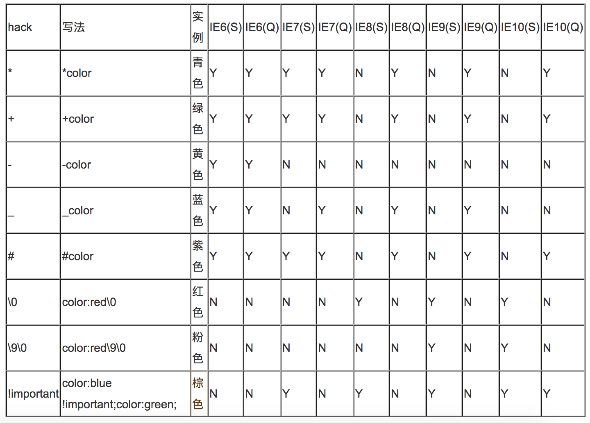
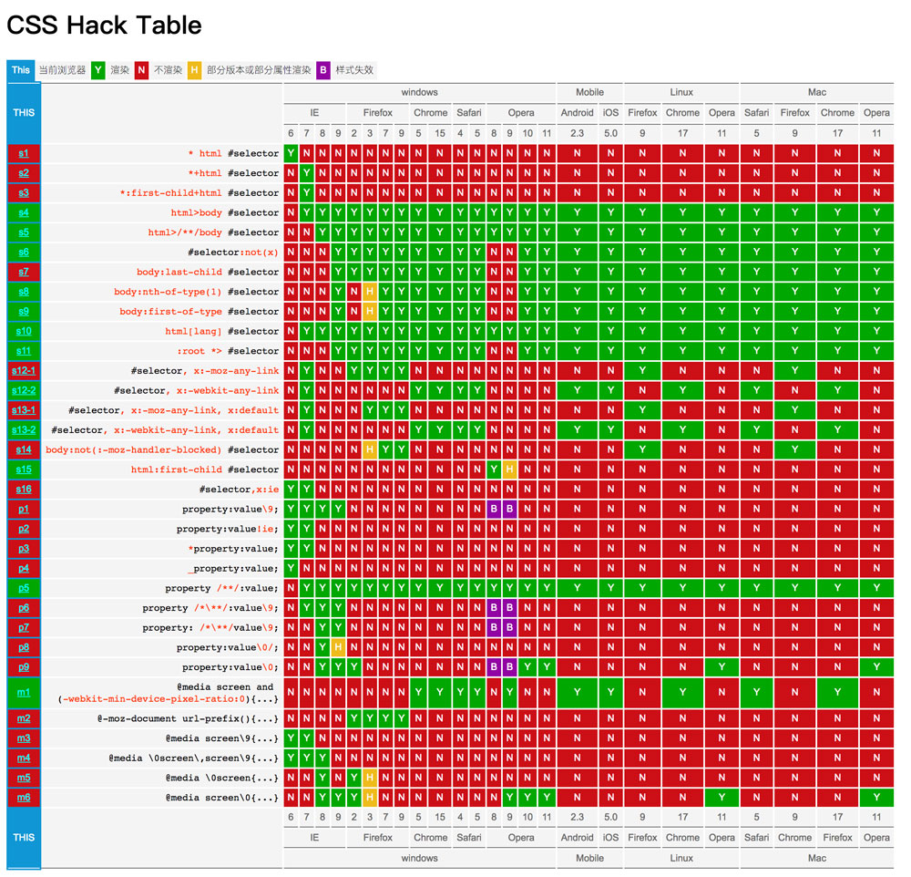

# 什么是 CSS hack？

## 基础概念

由于不同厂商的浏览器，比如Internet Explorer,Safari,Mozilla Firefox,Chrome等，或者是同一厂商的浏览器的不同版本，如IE6和IE7，对CSS的解析认识不完全一样，因此会导致生成的页面效果不一样，得不到我们所需要的页面效果。

这个时候我们就需要针对不同的浏览器去写不同的CSS，让它能在不同的浏览器中也能得到我们想要的页面效果。

## CSS hack的原理

* 不同浏览器和同一浏览器的不同版本对CSS的支持和解析结果不一样；
* CSS优先级对浏览器展现效果的影响。

## CSS hack分类

CSS Hack大致有3种表现形式，`CSS属性前缀法`、`选择器前缀法`以及`IE条件注释法`（即HTML头部引用if IE）Hack，实际项目中CSS Hack大部分是针对IE浏览器不同版本之间的表现差异而引入的。

1. 属性前缀法(即类内部Hack)：例如 IE6能识别下划线"*"和星号" \* "，IE7能识别星号" * "，但不能识别下划线"*"，IE6~IE10都认识"\9"，但firefox前述三个都不能认识。
2. 选择器前缀法(即选择器Hack)
3. IE条件注释法(即HTML条件注释Hack)：针对所有IE(注：IE10+已经不再支持条件注释)： `<!--[if IE]>IE浏览器显示的内容 <![endif]-->`，针对IE6及以下版本：`<!--[if lt IE 6]>只在IE6-显示的内容 <![endif]-->`。这类Hack不仅对CSS生效，对写在判断语句里面的所有代码都会生效。

# 谈一谈浏览器兼容的思路

- 要不要做
  - 产品的角度（产品的受众、受众的浏览器比例、效果优先还是基本功能优先）
  - 成本的角度 (有无必要做某件事)
- 做到什么程度
  - 让哪些浏览器支持哪些效果
- 如何做
  - 根据兼容需求选择技术框架/库(jquery)
  - 根据兼容需求选择兼容工具([html5shiv.js](https://github.com/aFarkas/html5shiv)、[respond.js](https://github.com/scottjehl/Respond)、[css reset](https://segmentfault.com/a/1190000003021766)、[normalize.css](https://github.com/necolas/normalize.css)、[Modernizr](https://github.com/Modernizr/Modernizr))
  - [postCSS](https://github.com/postcss/postcss)
  - 条件注释、CSS Hack、js 能力检测做一些修补

# 列举5种以上浏览器兼容的写法

## 条件注释法

条件注释 (conditional comment) 是于HTML源码中被IE有条件解释的语句。条件注释可被用来向IE提供及隐藏代码。

**IE10不再支持条件注释**

参考信息：https://msdn.microsoft.com/zh-cn/library/ie/hh801214%28v=vs.85%29.aspx


| 项目     | 范例                      | 说明       |
| ------ | ----------------------- | -------- |
| ！      | [if !IE]                | 非IE      |
| lt     | [if lt IE 5.5]          | 小于IE 5.5 |
| lte    | [if lte IE 6]           | 小于等于IE6  |
| gt     | [if gt IE 5]            | 大于 IE5   |
| gte    | [if gte IE 7]           | 大于等于IE7  |
| &#124; | [if (IE 6)&#124;(IE 7)] | IE6或者IE7 |

使用示例：

```html
 <!--[if IE 6]>
    <p>You are using Internet Explorer 6.</p>
    <![endif]-->
    <!--[if !IE]><!-->
    <script>alert(1);</script>
    <!--<![endif]-->
    <!--[if IE 8]>
    <link href="ie8only.css" rel="stylesheet">
    <![endif]-->
```

## 类内属性前缀法

即在CSS样式属性名前加上一些特定的符号，使得它只能在特定的浏览器中识别并显示样式。

IE浏览器各版本 CSS hack 对照表



注：S——Standars mode（标准模式）；Q——Quirks mode（怪诞模式）。

使用示例：

```css
.box{
  color: red;
  _color: blue; /*ie6*/
  *color: pink; /*ie67*/
  color: yellow\9;  /*ie/edge 6-8*/
}
```


## 选择器前缀法

选择器前缀法是针对一些页面表现不一致或者需要特殊对待的浏览器，在CSS选择器前加上一些只有某些特定浏览器才能识别的前缀进行hack。



查看源信息以及更多资料：https://swordair.com/tools/css-hack-table/；

https://msdn.microsoft.com/zh-cn/library/cc351024%28v=vs.85%29.aspx

## 条件注释+类选择器

```html
<!DOCTYPE html>
<!--[if IEMobile 7 ]> <html dir="ltr" lang="en-US"class="no-js iem7"> <![endif]-->
<!--[if lt IE 7 ]> <html dir="ltr" lang="en-US" class="no-js ie6 oldie"> <![endif]-->
<!--[if IE 7 ]>    <html dir="ltr" lang="en-US" class="no-js ie7 oldie"> <![endif]-->
<!--[if IE 8 ]>    <html dir="ltr" lang="en-US" class="no-js ie8 oldie"> <![endif]-->
<!--[if (gte IE 9)|(gt IEMobile 7)|!(IEMobile)|!(IE)]><!--><html dir="ltr" lang="en-US" class="no-js"><!--<![endif]-->
```


## Modernizr工具

GitHub仓库地址：[https://github.com/Modernizr/Modernizr](https://github.com/Modernizr/Modernizr)

官网地址：[https://modernizr.com](https://modernizr.com)

下载js文件以后在html文件添加以下内容即可使用：

```html
<script src="Scripts/Modernizr.js" type="text/javascript"></script>
```

添加完Modernizr引用以后，它就立即生效了。运行的时候它会在html元素上添加一批CSS的class名称，这些class名称标记当前浏览器支持哪些特性和不支持哪些特性，支持的特性就直接显示该天特性的名称作为一个class（例如:canvas,websockets），不支持的特性显示的class是“no-特性名称”（例如：no-flexbox）。下面这段代码是运行在Chrome下的效果：

```html
<html class=" js flexbox canvas canvastext webgl no-touch geolocation postmessage
              websqldatabase indexeddb hashchange history draganddrop websockets
　　　　　　　　rgba hsla multiplebgs backgroundsize borderimage borderradius
　　　　　　　　boxshadow textshadow opacity cssanimations csscolumns cssgradients
　　　　　　　　cssreflections csstransforms csstransforms3d csstransitions fontface
　　　　　　　  generatedcontent video audio localstorage sessionstorage webworkers
              applicationcache svg inlinesvg smil svgclippaths">
```

下面这段代码是运行在IE9下的效果：

```html
<html class=" js no-flexbox canvas canvastext no-webgl no-touch geolocation
              postmessage no-websqldatabase no-indexeddb hashchange no-history
　　　　　　　　draganddrop no-websockets rgba hsla multiplebgs backgroundsize
　　　　　　　　no-borderimage borderradius boxshadow no-textshadow opacity
　　　　　　　　no-cssanimations no-csscolumns no-cssgradients no-cssreflections
　　　　　　　　csstransforms no-csstransforms3d no-csstransitions fontface
　　　　　　　　generatedcontent video audio localstorage sessionstorage
　　　　　　　　no-webworkers no-applicationcache svg inlinesvg smil svgclippaths">
```

参考信息：[https://segmentfault.com/a/1190000003820989](https://segmentfault.com/a/1190000003820989)

# 以下工具/名词是做什么的

## 条件注释

条件注释 (conditional comment) 是于HTML源码中被IE有条件解释的语句。条件注释可被用来向IE提供及隐藏代码。

IE10+不再支持条件注释。

## IE Hack

为了改善IE浏览器的渲染兼容问题，为不同版本的IE浏览器编写不同的解决方案。

## js 能力检测

使用js对浏览器的能力进行检测，以方便对他的兼容性维护。

## html5shiv.js

兼容浏览器对HTML5标签的支持问题。

GitHub仓库地址：[https://github.com/aFarkas/html5shiv](https://github.com/aFarkas/html5shiv)

使用方法：

```html
<!--[if lt IE 9]>
<script type="text/javascript"  src="http://www.ijquery.cn/js/html5shiv.js"></script>
<![endif]-->
```


## respond.js

兼容浏览器的媒体查询功能。

GitHub仓库地址：[https://github.com/scottjehl/Respond/](https://github.com/scottjehl/Respond/)

## css reset

重新定义标签样式，以此来覆盖浏览器的默认样式。

## normalize.css

对`normalize.css`进行引用，可以让不同浏览器在渲染的时候样式更加统一，为浏览器的渲染方式提供了高度一致性。

Normalize.css 只是一个很小的CSS文件，但它在默认的HTML元素样式上提供了跨浏览器的高度一致性。相比于传统的CSS reset，Normalize.css是一种现代的、为HTML5准备的优质替代方案。Normalize.css现在已经被用于Twitter Bootstrap、HTML5 Boilerplate、GOV.UK、Rdio、CSS Tricks 以及许许多多其他框架、工具和网站上。

`Normalize.css`和传统Reset的区别：
1. `Normalize.css` 保护了有价值的默认值；
2. `Normalize.css` 修复了浏览器的一些bug；
3. `Normalize.css` 不会让你的调试工具变的杂乱；
4. `Normalize.css` 是模块化的；
5. `Normalize.css` 拥有详细的文档。

GitHub仓库地址：[https://github.com/necolas/normalize.css](https://github.com/necolas/normalize.css)
官网地址：[http://nicolasgallagher.com/about-normalize-css/](http://nicolasgallagher.com/about-normalize-css/)

bootCDN上的引用方式：
```html
<link href="//cdn.bootcss.com/normalize/7.0.0/normalize.css" rel="stylesheet">
```

注：href地址以`//`开头，能够自动识别网站所采用的协议。

## Modernizr

用js手段来检测用户代理浏览器特性，从而方便进行兼容性设置。

GitHub仓库地址：[https://github.com/Modernizr/Modernizr](https://github.com/Modernizr/Modernizr)

官网地址：[https://modernizr.com](https://modernizr.com)

## postCSS

通过自定义插件和工具这样的生态系统来改造CSS，能够把扩展的语法和特性转换成现代的浏览器友好的CSS。

GitHub仓库地址：[https://github.com/postcss/postcss](https://github.com/postcss/postcss)

官网地址：[http://postcss.org/](http://postcss.org/)

# 一般在哪个网站查询属性兼容性？

* [**caniuse**](http://caniuse.com/) :查css属性、选择器在各浏览器的兼容。
* [**browserhacks**](http://browserhacks.com/):查css属性、选择器在各浏览器Hack的写法


